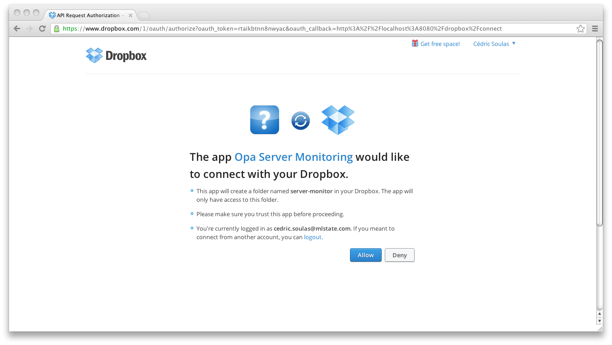

# Switch from MongoDB to Dropbox database, in just a few minutes #

## Database directives ##

Just add the `@dropbox` directive to the previous database definition:

	database monitor @dropbox {
	    stringmap(log) /logs
		    stringmap(job) /jobs
		    /logs[_]/status = { ok }
	}

Yes, that's all, your database now runs on top of Dropbox. You don't have to modify any function inside the `Job module.

      function test(name, url, status) { msg("", "label-inverse", "You should see a Dropbox popup on your desktop"); }
      function error_test(_) { test(Dom.get_value(#name), Dom.get_value(#url), { error_simulation }) }

    <a class="btn btn-small btn-inverse" onclick={Action.error_test}>
      <i class="icon-fire icon-white"/> Simulate a failure
    </a>

## Dropbox login page ##

You need to add functions so the user can log into your app with his dropbox account. Let's take the opportunity to put it inside a `Controller` module:

	module Controller {
	
	    DropboxUser = DbDropbox.User(monitor)
	
	    private function access_page(raw_token) {
	        match (DropboxUser.get_access(raw_token)) {
	        case { success } -> Resource.default_redirection_page("/")
	        case { failure : error } -> Resource.html("Error", <>{error}</>)
	        }
	    }
	
	    private function login_page() {
	        redirect = "http://localhost:8080/dropbox/connect"
	        if (DropboxUser.is_authenticated()) {
	          Resource.page("Server monitor", View.page())
	        }else{
	          match (DropboxUser.get_login_url(redirect)) {
	          case { success : url } -> Resource.default_redirection_page(url)
	          case { failure : error } -> Resource.html("Error", <>{error}</>)
	          }
	        }
	    }
	
	    dispatch = parser {
	        case "/dropbox/connect?" raw_token=(.*) -> access_page(Text.to_string(raw_token))
	        case (.*) -> login_page()
	    }
	}

Those functions are pretty straightforward, it follows the `OAuth` protocol to retrieve the access tokens to the user Dropbox account.

## Custom Url Parser ##

`dispatch` is a url parser you will call in the `Server.start` function. Replace the simple and default url handler to use this custom parser:

	Server.start(
	    Server.http,
	    [ { register : { doctype : { html5 } } },
     		{ title : "hello", page : View.page }
   			{ custom : Controller.dispatch }
	    ]
	)
