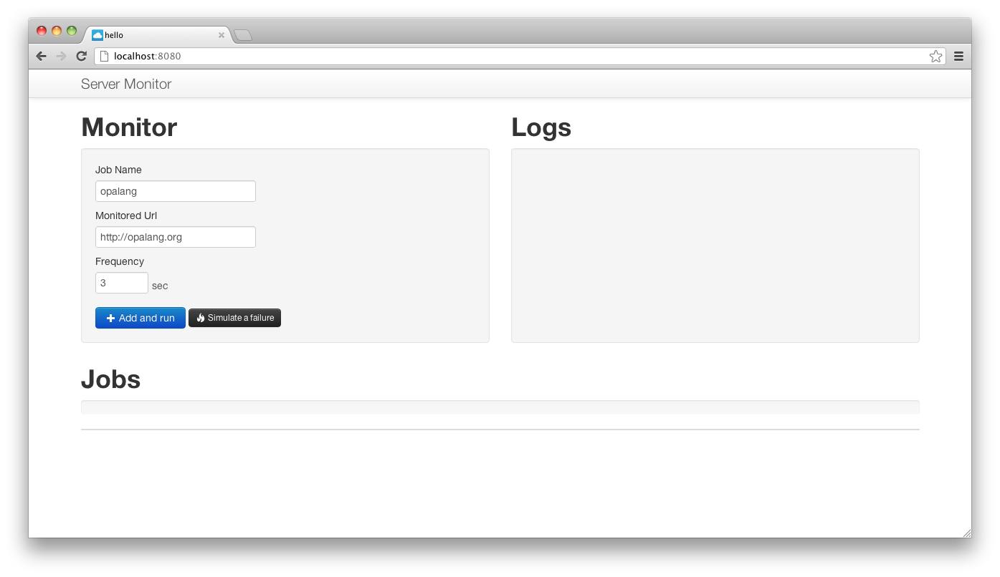
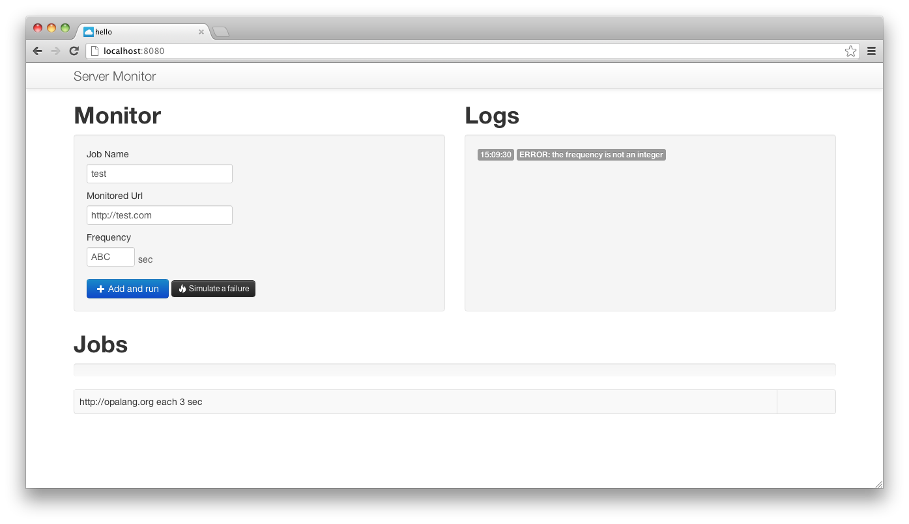
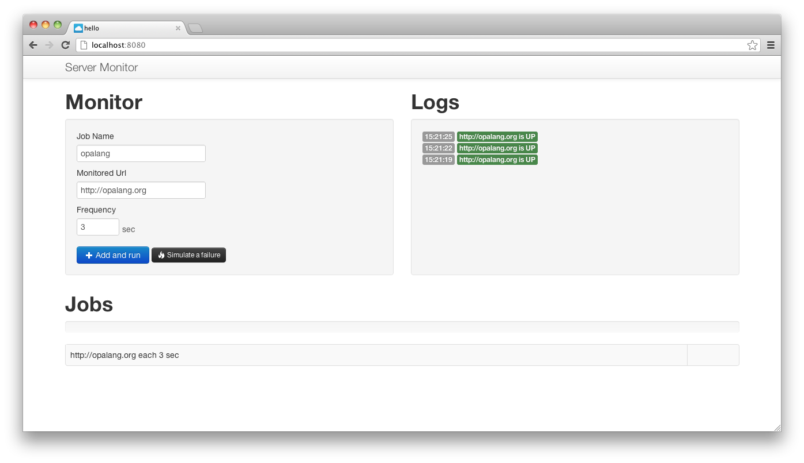
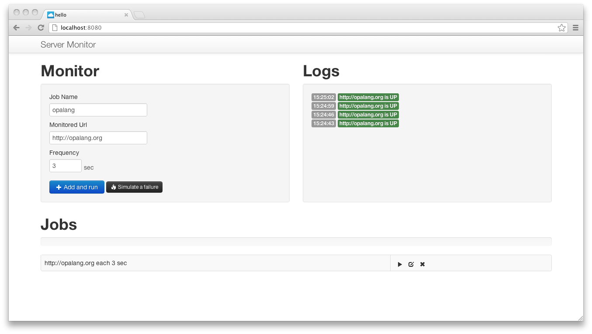

# View #

## Initial User Interface ##

Let's start the user interface. Add a `View` module with a `page` function inside that will serve the HTML page:

    module View {

        function page() {
            

                    <a href="/hero" class="brand">Server Monitor</a><ul class="nav "></ul>
            

            

            

            

                <h1>Monitor</h1><form class="well">
                    

                    <label>Job Name</label><input type="text" id=#name value="opalang"/>
                    <label>Monitored Url</label><input type="text" id=#url value="http://opalang.org"/>
                    <label>Frequency</label><input class="input-mini" type="text" id=#freq value="3"/>sec
                    

                    <a class="btn btn-primary"><i class="icon-plus icon-white"/> Add and run</a>
                    <a class="btn btn-small btn-inverse"><i class="icon-fire icon-white"/> Simulate a failure</a>
                </form>
            

            

                <h1>Logs</h1>

            

            

            

                <h1>Jobs</h1>
                

                    

                

                <table class="table table-striped table-bordered"><tbody id=#jobs></tbody></table>
            

            

        }
    }

As can see, Opa provides native support of HTML. Try to write invalid HTML like deleting a closing tag: the compiler will raise a syntax error at compile time.

## Http Server ##

Add, outside of the `View` module, a http server configured to serve a default html5 page:

    Server.start(
        Server.http,
        [ { register : { doctype : { html5 } } },
          { title : "hello", page : View.page }
        ]
    )

## Compile ##

Compile and see the result at the `http://localhost:8080` url.

	opa main.opa --

## Bootstrap theme ##

Use the default <a href="http://twitter.github.com/bootstrap/">bootstrap css theme</a> provided by Tweeter just importing it at the begining of your file. We also import the responsive css so the application can work well on mobile too:

    import stdlib.themes.bootstrap.{css, icons, responsive}

Compile and restart the server to see the style update!

# Add jobs (Client-side) #

## Update the Dom ##

Add a new `Action` module that will be responsible of the user interface updates. Opa dispatches the code on the server and the client side automatically, and automates the calls between client and server. To get more control and optimize your code, you can use `server` and `client` directives to tweak the compiler default dispatch behavior. For example, here we want all user interface related actions to be computed on the client side as much as possible. To do so, just add a `client` directive on the module to affect all functions inside it:

    client module Action {

        function msg(url, class, msg) {
            // Add a log on top of the logs list
            #info += 

                    {Date.to_string_time_only(Date.now())}
                    {url} {msg}
                     

        }

        function add_job(name, url, uri, freq) {
            // Add a new line on top of the job list
            #jobs += <tr id=#{name}>
                        <td>{url} each {freq} sec</td>
                        <td></td>
                     </tr>;

        }

    }

> **Dom manipulation**
>
> Opa provide many syntax and feature enhancements on top of JavaScript. We started with native HTML, now note the special syntax to manipulate the Dom: `#dom_id = 
Replace with this html fragment
` and `#dom_id += 
Add this on top of the current html fragments
``

## Parse user inputs ##

Inside the `Job` module, add functions to check the format of user inputs. Here it's based on the defaults parsers defined in the `(Parser)[http://doc.opalang.org/module/stdlib.core.parser/Parser]` module:

        function submit_job(_) {

            function p(f, d, error){
                match (f(Dom.get_value(d))) {
                case {none}: msg("ERROR:", "label-error", error); none
                case r: r
                }
            }

            // Parse formular inputs and add the job
            uri  = p(Uri.of_string, #url,  "the url is invalid");
            name = p(Parser.ident,  #name, "the log name is not a valid ident name");
            freq = p(Parser.int,    #freq, "the frequency is not an integer");

            match ((uri, name, freq)) {
            case ({some:uri}, {some:name}, {some:freq}): add_job(name, Dom.get_value(#url), uri, freq)
            default: void // some invalid inputs, don't add the job
            }
        }

    }

> **Unused arguments**
>
> The `_` means we don't care what the name and the value of this argument is. In this case, it would be a value of type `Dom> event` given by events like `onclick` or `onready`.

## Dom events ##

In the View.page function, update the `Add and run` html button so the the `submit_job` function is called when a user click on the button. It's really easy to deal with Dom events with Opa: just put the function to call inside curly brackets and attach it to the event:

    <a class="btn btn-primary" onclick={ Action.submit_job }><i class="icon-plus icon-white"/> Add and run</a>

# Server Monitoring #

    module Job {

      exposed @async function check(name, url, uri) {
          match (WebClient.Get.try_get(uri)) {
          case { failure : { timeout } } : Action.down(name, url, "socket timeout", { timeout })
          case { failure : { network } } : Action.down(name, url, "impossible to reach the server", { unreachable })
          case { failure : { uri : _, reason : _ } } : Action.down(name, url, "Invalid url. Missing http:// prefix?", { unknown_error })
          case { failure : f }           : Action.down(name, url, "other reason: {f}", { unknown_error })
          case { success : _ }           : Action.up(url)
          }
      }

    }

## Actions ##

      function up(url) { msg(url, "label-success", "is UP") }
      function invalid(url) { msg("ERROR: {url}", "label-inverse", "an invalid url") }
      function down(name, url, failure, status) { msg(url, "label-important", "is DOWN ({failure})"); }
      function test(name, url, status) { msg("", "label-inverse", "You should see a Dropbox popup on your desktop"); }
      function error_test(_) { test(Dom.get_value(#name), Dom.get_value(#url), { error_simulation }) }

## Timer ##

    function add_job(name, url, uri, freq) {
        timer = Scheduler.make_timer(freq*1000, function() { Job.check(name, url, uri) });
        Job.check(name, url, uri); timer.start();
        ...
    }

# Add buttons #

## Edit and remove buttons, the easy ones ##

In the `add_job` functions add:

      	function remove(_) { timer.stop(); Dom.remove(#{name}); }
      	function edit(_) {
      	    timer.stop(); Dom.remove(#{name});
      	    Dom.set_value(#name, name); Dom.set_value(#url, url)
      	    Dom.set_value(#freq, String.of_int(freq))
      	}

      	edit_btn = <a class="btn-mini" onclick={edit}><i class="icon-edit"></i></a>
      	remove_btn = <a class="btn-mini" onclick={remove}><i class="icon-remove"></i></a>

## Play and pause buttons are recursive ##

For each line inside list of jobs, we want to display a Play/Pause toggle button.
Let's create define a unique html ID for each job buttons:

      	player_id = "{name}_player";

When you click `Stop` the timer stop and the `Start` button is displayed instead. This is similar for the `Play` button. As you can see, those two states of the buttons depends on each other:

Use the `recursive` and `and` keywords to define such a cycle definition:

      	recursive function stop(_) { timer.stop(); #{player_id} = start_btn }
      	      and function start(_) { timer.start(); #{player_id} = stop_btn }
      	      and stop_btn = <a class="btn-mini" onclick={stop}><i class="icon-pause"></i></a>
      	      and start_btn = <a class="btn-mini" onclick={start}><i class="icon-play"></i></a>

## Add buttons to the interface ##

      	// Add a new line on top of the job list
      	#jobs += <tr id=#{name}>
      	        <td>{url} each {freq} sec</td>
      	        <td>{stop_btn}{edit_btn}{remove_btn}</td>
      	        </tr>;

      }

# Store jobs in MongoDB database ##

## Database definition ##

	type status = { timeout } or { unreachable } or { unknown_error } or { error_simulation } or { ok }
	type log = { string url, status status, Date.date date }
	type job = { string url, int freq }

	database monitor {
	    stringmap(log) /logs
		  stringmap(job) /jobs
		  /logs[_]/status = { ok } // Define for example the default "status" value
	}

## Records definition and shortcuts ##

A job, as defined previously can be created this way:

	job = { url:"http://opalang.org", freq:10 };

The record can be based on `url` and `freq` previously defined value:

	url = "http://opalang.org"
	freq = 10
	job = { url:url, freq:freq };

The `url:url construction, when the field name and the value name are the same, can be shortened writting simply ~url:

	job = { ~url, ~freq };

When all fields shortened this way, you finally just write:

	job = ~{ url, freq }

## Add and remove elements in the database ##

The previously defined job value can be inserted inside the database just writing:

	/monitor/jobs[name] <- job

This is the special _path notation_ to access and update the database.

Inside the `Job` module add 3 functions to log events, get, add and remove a job.
Those function use the datatbase. All functions those use directly or indirectly the database are _protected_ by default. It means they can't be called from a client and that your data is protected by default. 

You have to explicitly add entry points on your server adding the _exposed_ directive on function: at the begining of those functions you will perform proper access controls like checking user crendentials. For this tutorial we keep it simple and unsecure:

    	exposed @async function log(name, label, url, status) {
	        date = Date.now();
	        name = "[{label}] {name} - {Date.in_milliseconds(date) / 1000}";
	        /monitor/logs[name] <- (~{ url, status, date }) // Add a log in the database logs list
	    }
	
	    exposed @async function add(name, url, freq){ /monitor/jobs[name] <- (~{ url, freq }) }
	    exposed @async function remove(name){ Db.remove(@/monitor/jobs[name]) }
		  exposed function get_all(){ /monitor/jobs }

## Load jobs on page startup ##

In the `Action` module add a function to load all jobs and add it in the user interface. Use the `@async` directive to load those jobs asynchronously, so the user can continue using the interface.

	  @async function load_all(_) {
	        Map.iter(
	            { function(name, job)
	                Option.switch(Action.add_job(name, job.url, _, job.freq), void, Uri.of_string(job.url))
	            }, Job.get_all()
	        )
	    }

> **Block notations**
>
> Note the special block notation to pass a function as an argument. You can write:
>
> 	function f1(v) { do_something(); }
> 	my_function(f1, argument2)
>
> Or directly:
>
> 	Map.iter(function(v) { do_something(); }, argument2)
>
> `function(v) { do_something(); }` is an anonymous function: it doesn't have a name (like `f1` in the first example) and you > pass it directly as an argument.
> You can also write it this way, which might be easier to read:
>
> 	Map.iter({ function(v) do_something(); }, argument2)
>
> The same principle applies for example to dom events, when you insert Opa expression inside curly brackets:
>
> 	

>
> can be written without the second block:
>
> 	

Now, just call the `load_all` function when the html table is ready:

	<table><tbody id=#jobs onready={Action.load_all}></tbody></table>

# Switch from MongoDB to Dropbox database, in just a few minutes #

## Database directives ##

Just add the `@dropbox` directive to the previous database definition:
	
	database monitor @dropbox {
	    stringmap(log) /logs
		    stringmap(job) /jobs
		    /logs[_]/status = { ok }
	}

Yes, that's all, your database now runs on top of Dropbox. You don't have to modify any function inside the `Job module.

## Dropbox login page ##

You need to add functions so the user can log into your app with his dropbox account. Let's take the opportunity to put it inside a `Controller` module:

	module Controller {
	
	    DropboxUser = DbDropbox.User(monitor)
	
	    private function access_page(raw_token) {
	        match (DropboxUser.get_access(raw_token)) {
	        case { success } -> Resource.default_redirection_page("/")
	        case { failure : error } -> Resource.html("Error", <>{error}</>)
	        }
	    }
	
	    private function login_page() {
	        redirect = "http://localhost:8080/dropbox/connect"
	        if (DropboxUser.is_authenticated()) {
	          Resource.page("Server monitor", View.page())
	        }else{
	          match (DropboxUser.get_login_url(redirect)) {
	          case { success : url } -> Resource.default_redirection_page(url)
	          case { failure : error } -> Resource.html("Error", <>{error}</>)
	          }
	        }
	    }
	
	    dispatch = parser {
	        case "/dropbox/connect?" raw_token=(.*) -> access_page(Text.to_string(raw_token))
	        case (.*) -> login_page()
	    }
	}

Those functions are pretty straightforward, it follows the `OAuth` protocol to retrieve the access tokens to the user Dropbox account.

## Custom Url Parser ##

`dispatch` is a url parser you will call in the `Server.start` function. Replace the simple and default url handler to use this custom parser:

	Server.start(
	    Server.http,
	    [ { register : { doctype : { html5 } } },
     		{ title : "hello", page : View.page }
   			{ custom : Controller.dispatch }
	    ]
	)

